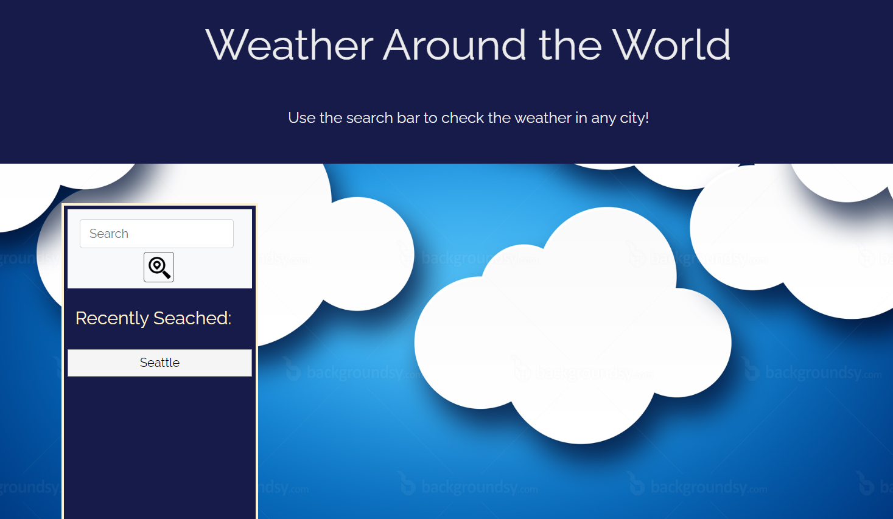
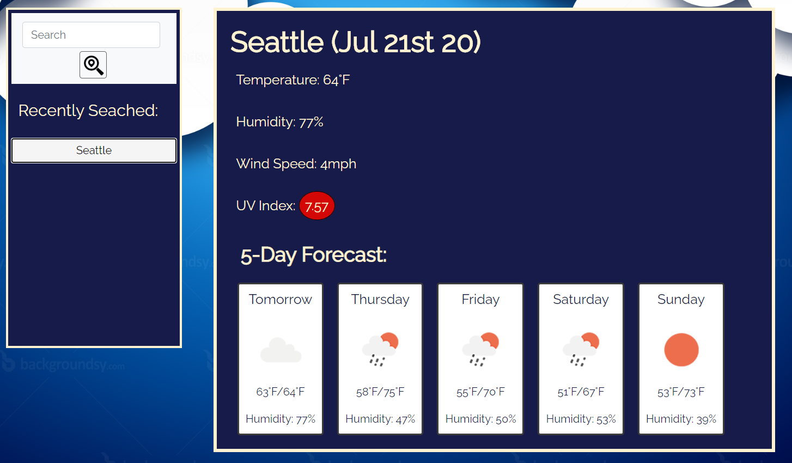

# Weather Dashboard

This application allows users to search the weather for cities all over the world. When the user searches a city, they are then presented with the temperature, 

## Code Description

This applications functions using an openweathermap web API to find the weather for the searched cities. The main dashboard is already built but hidden upon opening the page. Also when opening the page, the code checks for the last searched item (stored locally) and if it exists, then creates a button for it. The user can then click this button to render the weather for that city. The findWeather funtion changes the main dashboard to be visible and then uses the ajax function to find the weather in the city in the search bar (or on the city button based on what the user clicks). There are two ajax functions within the javaScript file. One that allows access to the temperature, humidity and wind speed. The second ajax function uses the latitude and longitude from the previous, to find the UV index as well as the 5-day forecast. For the UV index, if the value is below 3 then the background color is changed to green. If the value is between 3 and 5, then the backgorund color is changed to yellow. If the value is above 5, then the background color is changed to red. The default color is white. Note that all temperatures must be converted to Fahrenheit from Kelvin.

## Link & Photos of the Application

Link: https://jandrews16.github.io/weather-dashboard/

The following image demonstrates the application functionality:

